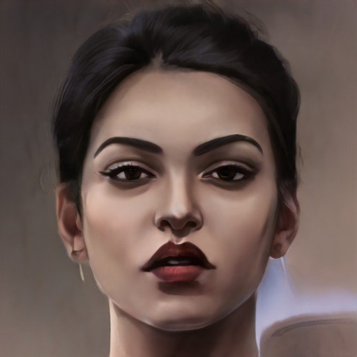
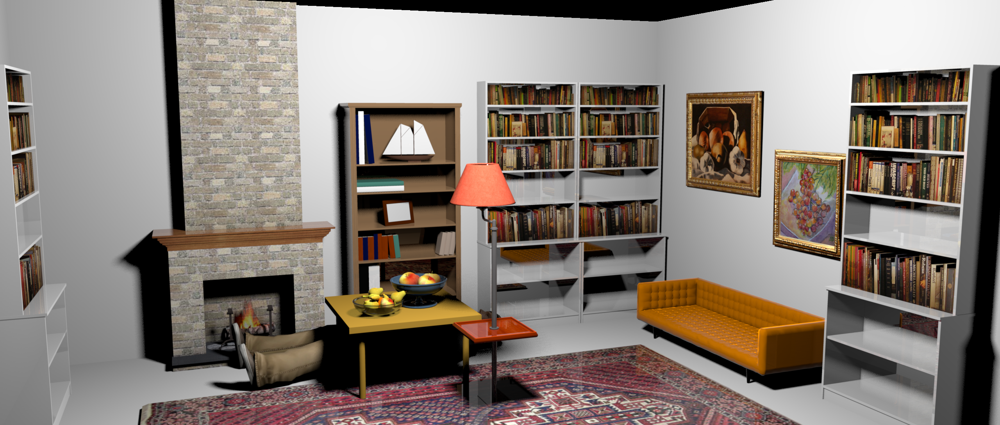

<html>
  <head>
    <li> <a href= "https://disk.yandex.ru/d/rxNiEUNsysul8w">Ссылка на шрифт </a> </li>
    <h1> Биография Розали </h1>
    </head>
  <body style="font-family:SVGFont 1"> </body>
    Розали
    
  <body>

 Розали прекрасная художница, которая пишет замечательные картины, но после смерти мужа что то пошло не так. Художница сошла с ума и стала писать жуткие, кровавые и темные картины. Со временем картины стали пользоваться популярностью, хотя многим они и не нравились. 
  Особенности написания картин: вместо обычных красок Розали использует все натуральное: клок волос вместо кистей, человеческие части, ягоды и т.д 

    </body>

 Картины Розали 

  
  

Рабочее место 

  
  <ul>
  <li> <a href= "https://www.youtube.com/watch?v=KV-2Bd0qsvc">Ссылка на видео истории Розали </a> </li>
</html>
